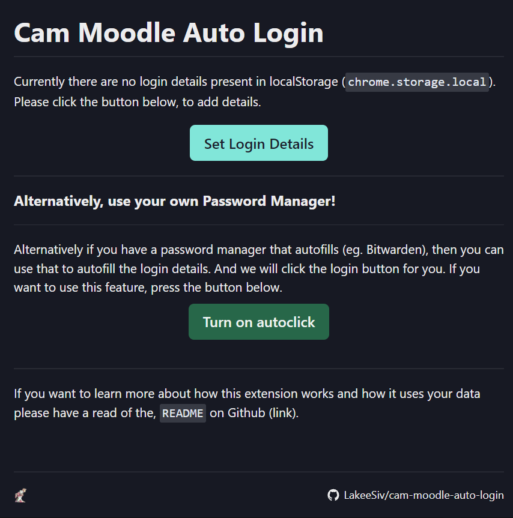
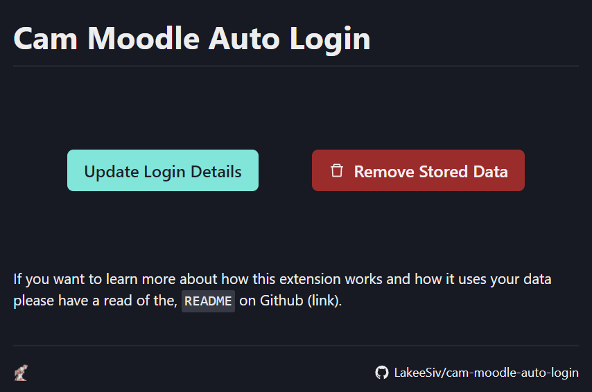

# Cam Moodle Auto Login

<p align="center">
  <a href="https://jojo.fandom.com/wiki/King_Crimson">
  
  </a>
</p>

# Aim

Many Cambridge students find it annoying that Moodle session timeouts (logging you out) way too quickly. This simple extension aims to eradicate this daily annoyance by automatically logging you back into Moodle through Raven.

# Demo


From this demo, you can see that it will automatically select "Login in By Raven", enter you details into the Raven Login, then click Login.

# Set Up

Firstly install the extension. Then click the extension symbol.

You should see something like this

<p align="center">
  
</p>

Click the "Set Login Details" button. This should open up a drawer where you can enter your login details and set them. Your login details will be encrypted and stored in the extensions local storage.

After that you are ready to go, and it should work as expected.

## Removing Data

After you are all set up, the popup for the extension should look something like this

<p align="center">
  
</p>

Clicking the "Remove Stored Data" should allow you to remove all of the data store in `chrome.storage.local`

# Your Data & Security

This is quite an important topic to talk about. Firstly, all data that is stored is stored **locally** (`chrome.storage.local`) on your hard drive meaning, no websites or even other extensions could access this data. None of you data is ever sent to any other location, this can be confirmed by checking the Network Tool on the chrome dev tools, no API requests are made by this extension.

Your data is encrypted (unlike other chrome extensions like [AutoFill](https://chrome.google.com/webstore/detail/autofill/nlmmgnhgdeffjkdckmikfpnddkbbfkkk?hl=en)) using this lightweight but meh [algorithm](https://stackoverflow.com/a/54026460/15032172) I found on stackoverflow. The reason why this was used was firstly, it very lightweight so reduces the bundle size, but more importantly, this worked nicely with webpack (whilst external crypto libraries seemed to make webpack cry).

All of these steps will help limit the likelihood of your login details being exposed.

## Note on the secret key

Due to the fact that this extension makes no API calls (this was a big aim for me, as if it did make API calls, then it would be hard for people to trust that their data isn't send anywhere), the secret key is technically "hard coded", although, to find it out one must so some searching through the complied, minimized javascript.

In case you would like to use your own secret key, then I would suggest that you build it from source.

# Building from source

> Note: yarn is used in the example commands

Clone the repo, then install the packages by running

```
yarn
```

then build the extension by running

```
yarn build
```

This should compile the code into a `dist` folder. You can now upload this folder in [chrome://extensions/](chrome://extensions/) (making sure to allow developer mode).

# The avatar

In case everyone cares, the avatar is `King Crismon` from JoJo Bizarre Adventure: Golden Wind. There is a reason why this avatar was used, other than having a JoJo reference in here

<details >

  <summary>Spoilers for JJBA: GW</summary>
  <p>
   The main ability of King Crismon is <b>Time Erasure</b>, and as you may realize, this extension basically erases the time that is normally used to re-login.

Meh reference, I know. I was just bored.

  </p>
</details>
